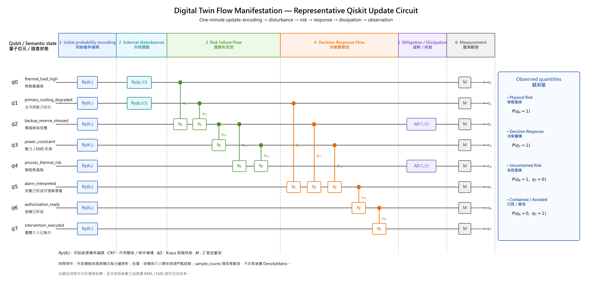
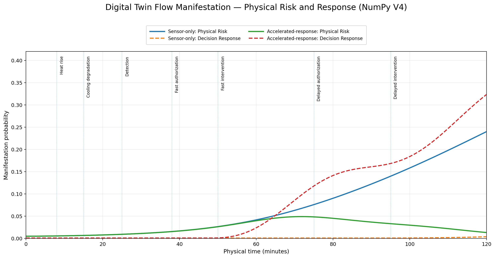
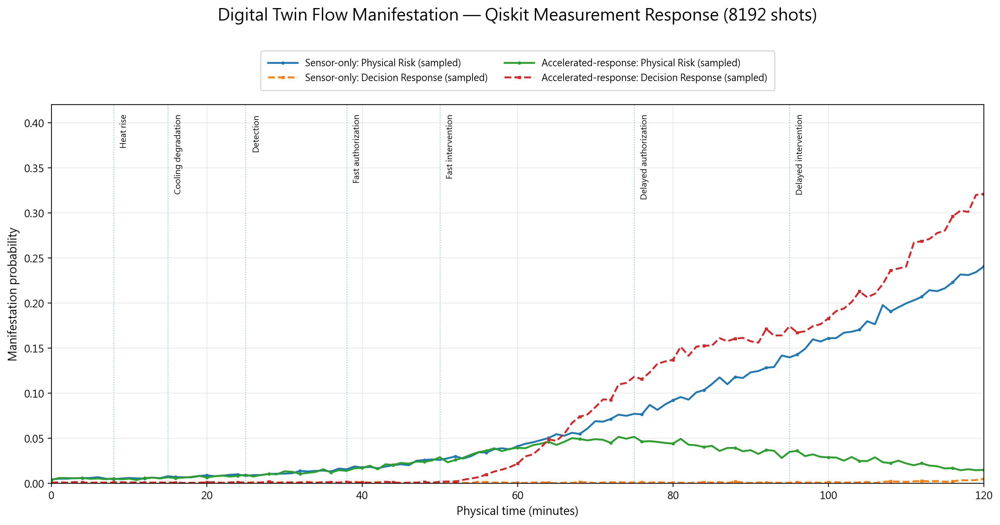

# Digital Twin Flow Manifestation

## 高科技廠房冷卻系統的風險失效流與決策響應流時間動態 POC

**理論提出者與作者：** Dr. Han-Jung (Alaric) Kuo（郭瀚嶸 博士）  
**所屬機構：** A&J Management Consulting Limited Company（瀚菱管理顧問有限公司）  
**實作狀態：** 可重現方法論概念驗證（Reproducible Methodological POC）  
**文件版本：** README V3，2026-08-06

> **Digital Twin = Digital Topology Manifesting Twin Information Flow**

本Repository觀測的核心問題是：

> **當高科技廠房的冷卻風險開始傳播，決策響應流能否在風險失效流完成關鍵傳播之前，穿過告警理解、授權與實體介入節點，真正改變後續狀態？**

整體實作可以濃縮為一條鏈：

```text
語意狀態
→ 量子位元機率
→ 作用關係與動態拓樸
→ 風險失效流／決策響應流共同演化
→ 介入後耗散
→ 數位孿生顯化
```

本POC使用相同的物理擾動與風險耦合，比較兩種響應情境。第120分鐘的精確密度矩陣結果如下：

| 情境 | Physical Risk | Decision Response | Uncontained Risk | Contained / Avoided |
|---|---:|---:|---:|---:|
| Sensor-only | 0.2401 | 0.0040 | 0.2389 | 0.0028 |
| Accelerated-response | 0.0134 | 0.3236 | 0.0071 | 0.3174 |

在本POC固定參數下，Accelerated-response相較Sensor-only呈現：

- Physical Risk降低 **94.4%**
- Uncontained Risk降低 **97.0%**
- Decision Response為 **81.7倍**
- Contained / Avoided為 **114.6倍**

這些數字是模型內部的情境比較，用來顯示響應拓樸改變後的演化差異；尚未經真實廠房事故資料校準。

---

## 如何閱讀這個Repository

第一次閱讀時，可先讀：

- **第1章**：研究問題與主要發現
- **第5章**：Qiskit線路究竟實作了什麼
- **第6章**：NumPy精確時間演化如何解讀
- **第7章**：Qiskit有限shots結果如何驗證

若要理解完整方法論，可接著閱讀第2至第4章。  
若要重現、檢查邊界或延伸研究，可閱讀第9至第12章。

## 章節目錄

1. [從這裡開始：本POC在觀測什麼](#1-從這裡開始本poc在觀測什麼)
2. [理論來源、順序與目前實作範圍](#2-理論來源順序與目前實作範圍)
3. [語意狀態、量子位元與觀測量](#3-語意狀態量子位元與觀測量)
4. [時間動態、雙重流向與情境設定](#4-時間動態雙重流向與情境設定)
5. [Qiskit代表性線路的完整解讀](#5-qiskit代表性線路的完整解讀)
6. [NumPy精確時間響應的分段解讀](#6-numpy精確時間響應的分段解讀)
7. [Qiskit有限shots結果與數值驗證](#7-qiskit有限shots結果與數值驗證)
8. [跨情境發現與Digital Twin Flow Manifestation](#8-跨情境發現與digital-twin-flow-manifestation)
9. [雙實作架構與Repository結構](#9-雙實作架構與repository結構)
10. [重現方式、輸出檔案與資料欄位](#10-重現方式輸出檔案與資料欄位)
11. [目前證據、可檢查條件與研究邊界](#11-目前證據可檢查條件與研究邊界)
12. [研究定位、後續演化、引用與權利](#12-研究定位後續演化引用與權利)

---

# 1. 從這裡開始：本POC在觀測什麼

## 1.1 研究問題

高科技廠房的數位孿生可以持續收到溫度、流量、壓差、設備狀態、能源與告警資料。然而，資料進入平台，只代表系統已經留下可見訊號。它是否已形成可理解的異常、是否取得授權、是否已派出人員或切換設備，屬於另一條作用鏈。

本POC因此將兩股流放入同一個物理時間軸：

```text
Risk Failure Flow
熱負載偏高／主冷卻能力劣化
→ 備援餘裕受壓
→ 電力／EMS約束
→ 製程熱風險
```

```text
Decision Response Flow
異常證據
→ 告警形成可理解意義
→ 授權形成
→ 實體介入
→ 備援壓力與製程熱風險耗散
```

研究焦點落在兩股流的時間競逐。感測器可以比人更早看見狀態，平台也可以快速顯示告警；真正改變物理未來的節點，仍是授權與實體介入。

## 1.2 主要發現

本POC產生四項直接觀測：

第一，兩個情境在第25分鐘以前幾乎重合，因為它們接受相同外部擾動與相同風險耦合。差異主要由第38分鐘以後的授權與介入條件逐步形成。

第二，Accelerated-response的Decision Response在第64分鐘首次超過Physical Risk；Physical Risk仍因前期累積與傳播慣性，在第72分鐘達到約 `0.0491` 的峰值，之後才持續下降。這表示響應形成與物理風險反轉之間存在時間差。

第三，Sensor-only的告警理解於第120分鐘已達 `0.3800`，授權只有 `0.0487`，實體介入則只有 `0.0040`。系統看見了風險，治理鏈仍停滯在告警與授權之間。

第四，外部熱負載在第85至105分鐘逐步回落，Sensor-only的Physical Risk依然由第85分鐘的 `0.1058` 上升至第120分鐘的 `0.2401`。原因在於主冷卻劣化仍持續、備援壓力與電力約束已累積，而實體介入不足以改寫後續狀態。

## 1.3 為什麼建立這個Repository

四篇理論文章分別處理語意量子動態、圖資演化、場域資料模型與數位拓樸。本Repository把它們壓縮為一個可執行最小入口：

- 可看到語意如何轉成可計算狀態。
- 可看到關係如何轉成會改變狀態的作用通道。
- 可看到兩股流如何在物理時間中競逐。
- 可看到介入如何透過開放系統耗散改變後續風險。
- 可由NumPy與Qiskit兩個實作交叉檢查。

---

# 2. 理論來源、順序與目前實作範圍

本Repository只採用四個理論來源，順序固定如下：

> **IQD → AGE → FFDM → Digital Topology**

| 理論來源 | 核心角色 | 本POC的可執行位置 |
|---|---|---|
| [I Ching Quantum Dynamics（IQD）](https://aj-consulting.net/iching-quantum-dynamics/) | 將語意狀態、外部張力、作用關係與動態演化轉成量子可計算結構 | 語意狀態轉成量子位元機率；作用關係轉成`Ry`、`CRY`與耗散通道 |
| [Architecture Graph Evolution（AGE）](https://aj-consulting.net/architecture-graph-evolution/) | 由不同時間、角色與來源留下的痕跡，生成多視角節點與關係 | 本POC先以人工定義的八個節點與十條作用關係，建立最小可運算圖場 |
| [Fractal Field Data Model Ontology（FFDM）](https://aj-consulting.net/fractal-field-data-model-ontology/) | 使資料痕跡、權重、版本與不確定性持續推動模型演化 | 每分鐘外部輸入、八個狀態、四個觀測量及驗證值都寫入CSV |
| [Digital Topology](https://aj-consulting.net/digital-topology/) | 讓物理、功能、資訊、權限、責任與狀態轉移關係成為可承載作用的通道 | Risk Failure Flow與Decision Response Flow在同一拓樸與同一時間軸上共同演化 |

**Digital Twin Flow Manifestation**是上述四項觀念的整體實作名稱。

## 2.1 理論到程式的最短映射

```text
IQD
語意狀態 → 量子位元機率
作用關係 → 旋轉／受控旋轉／耗散通道

AGE
場域痕跡 → 節點與候選關係

FFDM
逐分鐘輸入、狀態與結果 → 可追溯資料痕跡

Digital Topology
關係 → 真正改變目標狀態分布的作用通道

Digital Twin Flow Manifestation
雙重流向的時間演化 → 圖表、CSV與可介入狀態
```

## 2.2 目前解析度

目前模型位於八個語意節點的系統層級。它還沒有進入冷凍機、泵、閥、冷卻塔、管路與控制器的實體元件拓樸，也沒有從BIM、P&ID、BMS點位表或工單自動生成節點與關係。

本版本先回答一個更基礎的問題：語意狀態與跨系統作用鏈，能否形成可重複執行的動態模型。

---

# 3. 語意狀態、量子位元與觀測量

## 3.1 八個語意狀態

| Qubit | 程式欄位 | 中文語意 | 系統角色 |
|---|---|---|---|
| `q0` | `thermal_load_high` | 熱負載偏高 | 外部擾動 |
| `q1` | `primary_cooling_degraded` | 主冷卻能力劣化 | 外部擾動 |
| `q2` | `backup_reserve_stressed` | 備援餘裕受壓 | 風險傳播中介 |
| `q3` | `power_constraint` | 電力／EMS約束 | 跨系統限制 |
| `q4` | `process_thermal_risk` | 製程熱風險 | 主要風險目標態 |
| `q5` | `alarm_interpreted` | 告警已形成可理解意義 | 資訊進入決策鏈 |
| `q6` | `authorization_ready` | 授權已形成 | 治理與權限節點 |
| `q7` | `intervention_executed` | 實體介入已執行 | 系統改變節點 |

每一個量子位元的 $P(q_i=1)$，表示第 $i$ 個語意狀態在目前模型中的顯化機率。這些值是模型狀態權重，並非由歷史事故頻率直接估計而來。

## 3.2 初始機率編碼

初始語意機率 `p` 轉成Y軸旋轉角：

```math
\theta = 2\arcsin\sqrt{p}
```

因此：

```math
P(q=1)=\sin^2\left(\frac{\theta}{2}\right)=p
```

這使語意判斷可以進入密度矩陣、量子閘與開放系統通道的共同表示。

## 3.3 四個主要觀測量

| 觀測量 | 定義 | 解讀 |
|---|---|---|
| Physical Risk | `P(q4 = 1)` | 製程熱風險本身的邊際機率 |
| Decision Response | `P(q7 = 1)` | 實體介入已形成的邊際機率 |
| Uncontained Risk | `P(q4 = 1, q7 = 0)` | 風險存在且介入尚未形成 |
| Contained / Avoided | `P(q4 = 0, q7 = 1)` | 介入已形成且製程熱風險未顯化 |

Physical Risk與Decision Response是主圖使用的兩條曲線。Uncontained Risk與Contained / Avoided保留在CSV中，用來檢查風險與介入的聯合狀態。

---

# 4. 時間動態、雙重流向與情境設定

模擬範圍為 `0–120` 分鐘，時間步長為 `1` 分鐘，共執行121次狀態更新。

## 4.1 外部事件

| 事件 | 時間 | 模型作用 |
|---|---:|---|
| Heat rise | 8 min | `q0`開始接受熱負載旋轉 |
| Cooling degradation | 15 min | `q1`開始接受冷卻劣化旋轉 |
| Detection | 25 min | `q1/q2/q3 → q5`的告警理解通道開始作用 |
| Fast authorization | 38 min | Accelerated-response的`q5 → q6`開始作用 |
| Fast intervention | 50 min | Accelerated-response的`q6 → q7`開始作用 |
| Delayed authorization | 75 min | Sensor-only的`q5 → q6`延遲啟動 |
| Delayed intervention | 95 min | Sensor-only的`q6 → q7`延遲啟動 |
| Heat-load easing | 85–105 min | 外部熱負載逐步回落 |

## 4.2 風險作用拓樸

| Control | Target | 語意 |
|---|---|---|
| `q0` | `q2` | 熱負載提高備援壓力 |
| `q1` | `q2` | 冷卻劣化提高備援壓力 |
| `q2` | `q3` | 備援壓力推動電力／EMS約束 |
| `q2` | `q4` | 備援壓力推動製程熱風險 |
| `q3` | `q4` | 電力限制進一步推動製程熱風險 |

## 4.3 響應作用拓樸

| Control | Target | 語意 |
|---|---|---|
| `q1` | `q5` | 冷卻劣化證據進入告警理解 |
| `q2` | `q5` | 備援壓力證據進入告警理解 |
| `q3` | `q5` | 電力限制證據進入告警理解 |
| `q5` | `q6` | 已理解告警推動授權形成 |
| `q6` | `q7` | 已形成授權推動實體介入 |

## 4.4 兩種響應情境

| 參數 | Sensor-only | Accelerated-response |
|---|---:|---:|
| Detection | 25 min | 25 min |
| Authorization | 75 min | 38 min |
| Intervention | 95 min | 50 min |
| Alarm gain | 0.065 | 0.065 |
| Authorization gain | 0.018 | 0.100 |
| Intervention gain | 0.022 | 0.140 |
| Mitigation gain | 0.050 | 0.280 |

`Sensor-only`在本POC中代表感測與告警已存在，但治理與行動鏈條明顯延遲的系統；它仍保留很弱的晚期授權與介入，並非絕對零響應。

---

# 5. Qiskit代表性線路的完整解讀

下圖由Qiskit單檔程式中的Matplotlib函式直接生成：



這張圖呈現的不是一條只執行一次的靜態電路，也沒有把0至120分鐘的121次更新全部橫向展開。它抽取的是**每一分鐘都會重複執行的代表性更新單元**：

```text
目前密度矩陣
→ 注入本分鐘外部擾動
→ 推進Risk Failure Flow
→ 依時間門檻推進Decision Response Flow
→ 依目前介入機率施加耗散
→ 計算exact與sampled觀測量
→ 進入下一分鐘
```

因此，圖中的橫向順序表示**單一時間步內的運算順序**；真正的物理時間則由程式外層的分鐘迴圈推進。

## 5.1 先讀懂線路圖上的每一種符號

| 圖上符號 | 程式實作 | 數值作用 | 閱讀方式 |
|---|---|---|---|
| 水平黑線 `q0–q7` | 八個量子位元在同一個`DensityMatrix`中的索引 | 保存八個語意狀態的聯合機率振幅與相干項 | 每一條線代表一個語意狀態維度，不是實體電線、感測點或獨立時間序列 |
| 藍色 `Ry(θ_i)` 方框 | `RYGate(θ_i)` | 將第 $i$ 個初始機率 $p_i$ 編碼為 $P(q_i=1)=p_i$ | 八個方框只在模擬初始化時作用；此時各量子位元先形成乘積狀態 |
| 青色 `Ry(φ_L(t))`、`Ry(φ_D(t))` | 作用於`q0`、`q1`的局部`RYGate` | 依本分鐘熱負載與冷卻劣化函數改變局部狀態振幅 | 這是外部擾動注入，不需要其他量子位元先顯化 |
| 綠色實心控制點、垂直線與目標`Ry`方框 | Risk Failure Flow的`CRYGate` | 只在控制量子位元為1的分支上旋轉目標量子位元，改變兩者聯合分布 | 綠色表示物理／功能風險關係；控制點在來源節點，`Ry`方框在受作用節點 |
| 橘色實心控制點、垂直線與目標`Ry`方框 | Decision Response Flow的`CRYGate` | 將異常證據依序推進至理解、授權與實體介入 | 橘色表示資訊與治理響應；部分閘只有跨過Detection、Authorization或Intervention門檻後才啟動 |
| 紫色 `AD Γ_2(t)`、`AD Γ_4(t)` 方框 | `Kraus`振幅耗散通道 | 將`q2`或`q4`的狀態1機率向狀態0耗散 | 它表示介入後的緩解效果；不是再增加一條風險或響應節點 |
| 灰色 `M` 方框 | `DensityMatrix`機率讀取與`sample_counts` | 由目前狀態取得exact機率及有限shots觀測頻率 | `M`只負責觀測；sampled結果不覆寫下一分鐘使用的DensityMatrix |
| 右側 `c0–c7` | classical bit標示 | 表示Z基底量測結果的古典輸出位置 | 本POC以完整counts計算邊際與聯合機率，不以單次bitstring作結論 |
| 右側Observed quantities方框 | 邊際機率與聯合機率函式 | 計算Physical Risk、Decision Response、Uncontained Risk與Contained / Avoided | 這四項才是時間響應圖與CSV中主要被解讀的觀測量 |
| 階段上方淡色區塊 `1–6` | 程式中的運算分段 | 標示一分鐘更新內的處理順序 | 區塊寬度是為了排版與可讀性，不代表實際經過時間或計算成本 |

圖中的希臘字母也不是裝飾。其角色如下：

| 參數 | 所在位置 | 意義 |
|---|---|---|
| $\theta_i$ | 初始`RYGate` | 由第 $i$ 個初始機率 $p_i$ 轉換而來的編碼角 |
| $\phi_L(t)$ | `q0`局部旋轉 | 第 $t$ 分鐘熱負載輸入所形成的旋轉角 |
| $\phi_D(t)$ | `q1`局部旋轉 | 第 $t$ 分鐘冷卻劣化輸入所形成的旋轉角 |
| $\alpha_{ij}$ | 綠色`CRYGate` | Risk Failure Flow中由$q_i$作用至$q_j$的每分鐘耦合角 |
| $\beta_{ij}$、$\gamma_{ij}$ | 橘色`CRYGate` | Decision Response Flow中告警理解、授權與介入的耦合角 |
| $\Gamma_2(t)$、$\Gamma_4(t)$ | 紫色振幅耗散 | 依目前介入機率計算的狀態相依耗散強度 |

## 5.2 六個運算階段逐項拆解

| 階段 | 進入此階段的資料 | Qiskit運算 | 數學上改變了什麼 | 語意上產生什麼 | 啟動條件 |
|---|---|---|---|---|---|
| 1. Initial probability encoding | 八個初始機率$p_0,\ldots,p_7$與初始狀態$\lvert 0\rangle^{\otimes 8}$ | 對每個$q_i$套用`RYGate(θ_i)`，其中$\theta_i=2\arcsin\sqrt{p_i}$ | 建立$\lvert\psi_0\rangle=\bigotimes_i R_y(\theta_i)\lvert0\rangle$，再形成$\rho_0=\lvert\psi_0\rangle\langle\psi_0\rvert$；每個邊際滿足$P(q_i=1)=p_i$ | 八個語意判斷被放入同一個可共同演化的密度矩陣；此時只是共同表示，尚未由受控閘形成跨狀態作用 | 僅在模擬開始時執行一次 |
| 2. External disturbances | 本分鐘熱負載函數$L(t)$與冷卻劣化函數$D(t)$ | 對`q0`套用`RYGate(0.030L(t)\Delta t)`；對`q1`套用`RYGate(0.026D(t)\Delta t)` | 直接改變`q0`與`q1`的局部振幅，使其狀態1機率與其他量子位元的聯合分布隨時間移動 | 將場域外部的熱負載上升與主冷卻能力劣化注入模型 | 每分鐘依擾動函數更新 |
| 3. Risk Failure Flow | 已受外部擾動更新的$\rho(t)$ | 依序套用五個綠色`CRYGate`：`q0→q2`、`q1→q2`、`q2→q3`、`q2→q4`、`q3→q4` | 每個閘只旋轉控制位元為1分支中的目標位元；五個閘依程式順序連續更新同一個DensityMatrix | 熱負載與冷卻劣化先推動備援壓力，再經電力限制與直接路徑推動製程熱風險 | 每分鐘作用 |
| 4. Decision Response Flow | 異常、備援壓力及電力限制所形成的證據狀態 | Detection後套用`q1/q2/q3→q5`；Authorization後套用`q5→q6`；Intervention後套用`q6→q7`的橘色`CRYGate` | 依時間門檻開啟不同條件式旋轉，使證據狀態逐步改變理解、授權與介入的聯合分布 | 將「系統已有異常」推進成「有人理解」「權限成立」「物理行動已執行」 | 各閘分別依Detection、Authorization與Intervention門檻啟動 |
| 5. Mitigation / Dissipation | 本分鐘受控旋轉後的介入邊際機率$P(q_7=1)$ | 建立兩個`Kraus`振幅耗散通道，分別作用於`q2`與`q4` | 以$\Gamma_2(t)=g_mP(q_7=1)$及$\Gamma_4(t)=1.40g_mP(q_7=1)$，將狀態1人口向狀態0轉移並維持trace | 實體介入越可能形成，備援壓力與製程熱風險的耗散越強 | 每分鐘計算；介入機率很低時耗散也很弱 |
| 6. Measurement / Observation | 完成本分鐘所有閘與耗散後的DensityMatrix | 由矩陣對角線計算exact；以固定seed執行`sample_counts(8192)`取得sampled | exact是目前密度矩陣的確定機率；sampled是同一分布經有限次取樣後的觀測頻率 | 形成CSV、NumPy／Qiskit時間響應圖及四項主要觀測量 | 每分鐘輸出一次；sampled不回寫下一分鐘 |

第一階段不能只理解成「把八個機率放入共同空間」。完整含義是：

1. 每個語意狀態先有自己的初始權重$p_i$。
2. $p_i$被轉成旋轉角$\theta_i$。
3. `RYGate(θ_i)`把$\lvert0\rangle$旋轉成量測為1的機率等於$p_i$的量子位元。
4. 八個量子位元以張量積形成256維聯合狀態空間。
5. 後續局部旋轉、受控旋轉與耗散都更新同一個$256\times256$密度矩陣。

因此，「共同狀態空間」指的是八個語意狀態的所有二元組合都被共同保存與演化，而非把八個彼此獨立的機率並排存放。

## 5.3 Risk Failure Flow的五條線逐條代表什麼

| 作用邊 | 每分鐘旋轉角 | 控制條件 | 目標狀態如何改變 | 工程語意 |
|---|---:|---|---|---|
| `q0 → q2` | $0.025\Delta t$ | `thermal_load_high = 1`分支 | 旋轉`backup_reserve_stressed` | 熱負載偏高使備援冷卻餘裕承受更大壓力 |
| `q1 → q2` | $0.035\Delta t$ | `primary_cooling_degraded = 1`分支 | 旋轉`backup_reserve_stressed` | 主冷卻能力劣化直接消耗備援餘裕 |
| `q2 → q3` | $0.018\Delta t$ | `backup_reserve_stressed = 1`分支 | 旋轉`power_constraint` | 備援設備投入、負載轉移或容量逼近使電力／EMS約束升高 |
| `q2 → q4` | $0.032\Delta t$ | `backup_reserve_stressed = 1`分支 | 旋轉`process_thermal_risk` | 備援餘裕不足直接提高製程熱風險 |
| `q3 → q4` | $0.025\Delta t$ | `power_constraint = 1`分支 | 旋轉`process_thermal_risk` | 電力限制阻礙冷卻資源增援，使製程風險進一步累積 |

這五個閘不是一次同時「畫出關聯」而已。程式依表中順序連續執行：前一個閘更新後的DensityMatrix，會成為下一個閘的輸入。因此，`q0/q1 → q2 → q3/q4`在單一分鐘內已形成可傳遞的作用鏈。

例如，圖中一條完整的風險路徑可以這樣讀：

```text
q1 primary_cooling_degraded
→ CRY(α12)提高q2 backup_reserve_stressed
→ CRY(α24)提高q4 process_thermal_risk
```

另一條跨系統路徑則是：

```text
q1 primary_cooling_degraded
→ q2 backup_reserve_stressed
→ q3 power_constraint
→ q4 process_thermal_risk
```

## 5.4 Decision Response Flow的五條線逐條代表什麼

| 作用邊 | 旋轉強度 | 啟動條件 | 目標狀態如何改變 | 治理語意 |
|---|---:|---|---|---|
| `q1 → q5` | `alarm_gain` | $t\geq$ Detection | 旋轉`alarm_interpreted` | 冷卻劣化證據進入告警理解 |
| `q2 → q5` | $0.85\times$`alarm_gain` | $t\geq$ Detection | 旋轉`alarm_interpreted` | 備援壓力提供第二組異常證據 |
| `q3 → q5` | $0.65\times$`alarm_gain` | $t\geq$ Detection | 旋轉`alarm_interpreted` | 電力限制提供跨系統佐證 |
| `q5 → q6` | `authorization_gain` | $t\geq$ Authorization | 旋轉`authorization_ready` | 已理解的告警開始穿過權限與治理節點 |
| `q6 → q7` | `intervention_gain` | $t\geq$ Intervention | 旋轉`intervention_executed` | 已形成授權開始轉成實體操作或資源調度 |

這條鏈刻意把`q5`、`q6`與`q7`分開，因為：

```text
資料已存在
≠ 告警已被理解
≠ 權限已經成立
≠ 實體系統已被改變
```

圖中的橘色路徑應由左向右讀成：

```text
q1/q2/q3的異常證據
→ q5 alarm_interpreted
→ q6 authorization_ready
→ q7 intervention_executed
```

Sensor-only與Accelerated-response的物理擾動及Risk Failure Flow完全相同；兩者差異集中在`q5 → q6 → q7`的啟動時間、旋轉強度與後續耗散能力。

## 5.5 從一條完整閉環理解這張圖

以「備援餘裕受壓」為例，圖中同一個`q2`同時參與兩股流：

```text
Risk Failure Flow
q2 backup_reserve_stressed
→ q3 power_constraint
→ q4 process_thermal_risk
```

```text
Decision Response Flow
q2 backup_reserve_stressed
→ q5 alarm_interpreted
→ q6 authorization_ready
→ q7 intervention_executed
```

當`q7`的邊際機率提高，程式再計算：

```math
\Gamma_2(t)
=
\text{mitigation\_gain}\times P(q_7=1)
```

```math
\Gamma_4(t)
=
1.40\times\text{mitigation\_gain}\times P(q_7=1)
```

並將兩個振幅耗散通道作用回`q2`與`q4`。因此，完整閉環是：

```text
風險狀態形成
→ 異常證據被理解
→ 授權形成
→ 實體介入形成
→ 備援壓力與製程熱風險耗散
```

這裡需要精確區分兩種「控制」：

- 圖中的`CRYGate`是量子狀態內部的條件式作用。
- 耗散強度由程式先讀取$P(q_7=1)$再建立Kraus通道，屬於古典回饋控制的混合機制。

所以目前POC是**量子密度矩陣演化與古典狀態回饋結合的開放系統實作**，並非一條可以原封不動送入量子硬體執行的固定純量子電路。

## 5.6 exact與sampled到底差在哪裡

Qiskit版本在每分鐘完成演化後，從同一個DensityMatrix分成兩條觀測路徑：

```text
DensityMatrix at minute t
├─ exact：
│  直接讀取矩陣對角線
│  → 邊際機率與聯合機率
│  → 保存為*_exact
│
└─ sampled：
   以固定seed執行sample_counts(8192)
   → 取得bitstring出現次數
   → 換算觀測頻率
   → 保存為*_sampled
```

四項觀測量的計算方式如下：

| 觀測量 | exact計算 | sampled計算 | 解讀 |
|---|---|---|---|
| Physical Risk | 對所有$q_4=1$的對角元素求和 | 對所有$q_4=1$的bitstring次數求和再除以8192 | 製程熱風險本身的顯化機率 |
| Decision Response | 對所有$q_7=1$的對角元素求和 | 對所有$q_7=1$的bitstring次數求和再除以8192 | 實體介入已形成的顯化機率 |
| Uncontained Risk | 對所有$q_4=1,q_7=0$的對角元素求和 | 對符合$q_4=1,q_7=0$的bitstring次數求和再除以8192 | 風險已形成但介入尚未形成 |
| Contained / Avoided | 對所有$q_4=0,q_7=1$的對角元素求和 | 對符合$q_4=0,q_7=1$的bitstring次數求和再除以8192 | 介入已形成且風險未顯化 |

`sample_counts`不會取代或塌縮下一分鐘使用的DensityMatrix。本POC中的時間演化始終沿exact狀態繼續，sampled只模擬有限量測次數下的可觀測輸出。因此，Qiskit曲線上的鋸齒是觀測波動，不是系統狀態本身突然跳動。

---

# 6. NumPy精確時間響應的分段解讀



NumPy版本以手寫密度矩陣、局部旋轉、受控旋轉與Kraus通道，提供完全透明的精確參考實作。

## 6.1 關鍵時間點

| Minute | Sensor-only Risk | Sensor-only Response | Accelerated Risk | Accelerated Response | 主要意義 |
|---:|---:|---:|---:|---:|---|
| 25 | 0.0094 | 0.0010 | 0.0094 | 0.0010 | Detection啟動，兩情境仍重合 |
| 38 | 0.0156 | 0.0010 | 0.0155 | 0.0010 | Accelerated授權通道開始作用 |
| 50 | 0.0267 | 0.0010 | 0.0263 | 0.0012 | Accelerated介入通道開始作用 |
| 64 | 0.0496 | 0.0010 | 0.0448 | 0.0457 | Accelerated Response首次超過Risk |
| 72 | 0.0682 | 0.0010 | 0.0491 | 0.0993 | Accelerated Risk達到峰值 |
| 85 | 0.1058 | 0.0010 | 0.0410 | 0.1546 | 熱負載開始回落 |
| 95 | 0.1399 | 0.0010 | 0.0332 | 0.1685 | Sensor-only介入通道才開始作用 |
| 120 | 0.2401 | 0.0040 | 0.0134 | 0.3236 | 最終狀態形成明顯分岔 |

## 6.2 0–25分鐘：共同物理前史

兩個情境共用相同的初始狀態、熱負載、冷卻劣化與Risk Failure Flow。第25分鐘時，Physical Risk都為 `0.0094`。

這一段建立了比較基線：後續差異主要來自響應鏈的時間與強度，並非替Accelerated-response安排較輕的物理擾動。

## 6.3 25–50分鐘：看見異常仍未等於改變系統

Detection於第25分鐘啟動，告警理解開始累積。Accelerated-response於第38分鐘開啟授權通道，但第50分鐘的：

- `authorization_ready = 0.0225`
- `intervention_executed = 0.0012`
- `physical_risk = 0.0263`

授權通道剛開始形成，尚未立即造成風險下降。這段演化保留了治理動作與物理效果之間的時間差。

## 6.4 50–72分鐘：響應穿透後，風險仍有慣性

第50分鐘後，Accelerated-response的介入開始增長。第64分鐘：

```text
Decision Response = 0.0457
Physical Risk     = 0.0448
```

響應首次超過風險。Physical Risk仍在第72分鐘達到 `0.0491` 的峰值，顯示先前已形成的備援壓力與跨系統傳播不會在介入出現的同一分鐘立即消失。

Uncontained Risk更早在第 `61` 分鐘達到峰值 `0.0342`，之後隨介入形成開始下降。

## 6.5 72–120分鐘：兩種治理拓樸形成不同未來

Accelerated-response在第120分鐘形成：

| 狀態 | 機率 |
|---|---:|
| Alarm interpreted | 0.3749 |
| Authorization ready | 0.3341 |
| Intervention executed | 0.3236 |
| Physical Risk | 0.0134 |
| Contained / Avoided | 0.3174 |

Sensor-only在同一分鐘形成：

| 狀態 | 機率 |
|---|---:|
| Alarm interpreted | 0.3800 |
| Authorization ready | 0.0487 |
| Intervention executed | 0.0040 |
| Physical Risk | 0.2401 |
| Uncontained Risk | 0.2389 |

兩者都能看見異常；只有Accelerated-response形成足以推動耗散的介入強度。

## 6.6 為何熱負載下降後，Sensor-only風險仍上升

外部熱負載於第85分鐘開始回落，但主冷卻劣化保持高位。Sensor-only的備援壓力由第85分鐘的 `0.2781` 增至第120分鐘的 `0.3906`，電力／EMS約束也由 `0.0390` 增至 `0.0886`。

這代表系統狀態具有累積與路徑依賴。單一外部輸入緩解，未必足以逆轉已經進入備援、電力與製程風險鏈的狀態。

---

# 7. Qiskit有限shots結果與數值驗證



Qiskit版本同時輸出：

- `exact`：由`DensityMatrix`直接計算。
- `sampled`：由每個時間點8192 shots取得。

## 7.1 第120分鐘結果

| 情境 | Physical Risk sampled | Physical Risk exact | Decision Response sampled | Decision Response exact |
|---|---:|---:|---:|---:|
| Sensor-only | 0.2405 | 0.2401 | 0.0050 | 0.0040 |
| Accelerated-response | 0.0151 | 0.0134 | 0.3208 | 0.3236 |

第120分鐘的絕對差異為：

| 情境 | Physical Risk sampled − exact | Decision Response sampled − exact |
|---|---:|---:|
| Sensor-only | +0.0004 | +0.0010 |
| Accelerated-response | +0.0018 | -0.0028 |

## 7.2 全時間序列的取樣偏差

| 情境 | 觀測量 | Mean Absolute Error | Maximum Absolute Error |
|---|---|---:|---:|
| Sensor-only | Physical Risk | 0.00161 | 0.01187 |
| Sensor-only | Decision Response | 0.00030 | 0.00108 |
| Accelerated-response | Physical Risk | 0.00132 | 0.00572 |
| Accelerated-response | Decision Response | 0.00186 | 0.01171 |

這些偏差符合有限shots觀測會在exact值附近波動的預期。固定seed使本Repository在相同Python與Qiskit版本下可以重現相同取樣序列。

## 7.3 NumPy與Qiskit exact一致的意義

Pure NumPy與Qiskit共享：

- 相同初始機率
- 相同旋轉角
- 相同受控旋轉拓樸
- 相同事件時間
- 相同Kraus耗散參數
- 相同觀測量定義

兩者的exact結果一致，說明手寫密度矩陣運算與Qiskit框架實作對應成功。這是一項交叉驗證，並非兩套獨立物理模型產生巧合相同的預測。

## 7.4 shots代表什麼

8192 shots代表從目前DensityMatrix的量測分布中進行8192次有限取樣。它目前沒有包含：

- IBM Quantum硬體雜訊
- 讀出錯誤模型
- 閘誤差
- 退相干時間
- 編譯至特定硬體拓樸的限制

因此，Qiskit sampled曲線展示的是有限觀測頻率，不是量子硬體實驗結果。

---

# 8. 跨情境發現與Digital Twin Flow Manifestation

## 8.1 固定物理擾動下的響應比較

兩個情境共用相同外部擾動與Risk Failure Flow，只調整授權、介入時間與響應強度。這形成一個模型內部的反事實比較：

```text
相同風險前史
+ 不同Decision Response Flow
→ 不同後續狀態
```

在本POC設定下，響應拓樸改變後，Physical Risk降低 `94.4%`，Uncontained Risk降低 `97.0%`。

這個百分比表達的是固定模型假設下的情境差異，不能直接外推為真實工廠導入系統後的風險降低率。

## 8.2 資訊可見度與作用能力

Sensor-only最後具有很高的告警理解，實體介入仍接近零。這使下列差異可以被直接觀測：

| 層次 | 系統問題 |
|---|---|
| Data visibility | 資料是否已進入平台 |
| Alarm interpretation | 異常是否已形成可理解意義 |
| Authorization | 是否有角色能批准行動 |
| Physical intervention | 設備、人員或控制是否真的改變系統 |
| State evolution | 介入後的風險路徑是否已被改寫 |

數位孿生若只到Data visibility與Alarm interpretation，主要完成的是看見。Digital Twin Flow Manifestation要求孿生同時顯化：

- 風險正在往哪裡傳播
- 響應目前停在哪一個節點
- 哪一個權限或行動邊界正在造成延遲
- 介入是否已足以改變下一個時間步

## 8.3 Twin Information Flow的最小判準

本POC將Twin Information Flow拆成：

```text
Twin Information Flow
= Risk Failure Flow
+ Decision Response Flow
```

最小治理判準為：

> **Decision Response Flow必須在Risk Failure Flow完成關鍵傳播之前，到達能改變系統狀態的節點。**

在本案例中，這個節點是`q7 intervention_executed`。`q5 alarm_interpreted`仍位於資訊與理解層，`q6 authorization_ready`位於治理準備層；只有`q7`開始推動實體耗散。

## 8.4 本POC對數位孿生的推進

本Repository沒有以3D模型作為必要起點。八個節點同時包含：

- 物理狀態
- 功能風險
- 能源約束
- 資訊理解
- 權限形成
- 實體行動

這展示了一個更底層的數位孿生入口：先建立能承載作用的Digital Topology，再選擇圖表、BIM、GIS、3D或營運介面顯化其結果。

---

# 9. 雙實作架構與Repository結構

## 9.1 兩個實作的分工

兩個版本使用相同的八個語意狀態、初始機率、時間函數、五條Risk Failure Flow、五條Decision Response Flow、耗散公式與觀測量。差異只在於數值構件由誰提供。

| 實作 | 狀態容器 | 局部旋轉 | 條件式旋轉 | 耗散通道 | 觀測方式 | 主要角色 |
|---|---|---|---|---|---|---|
| Pure NumPy | `numpy.ndarray`保存$256\times256$複數密度矩陣 | `ry(θ)`建立$2\times2$矩陣，再由`apply_local_operator()`左、右乘密度矩陣 | `apply_controlled_operator()`在控制位元為1的索引子空間套用`ry(α)` | `amplitude_damping()`以$K_0$、$K_1$計算$\sum_kK_k\rho K_k^\dagger$ | 直接由密度矩陣對角線計算邊際機率、聯合機率與trace | 透明參考引擎；可逐步檢查位元索引、矩陣乘法、Kraus更新與每分鐘演化 |
| Qiskit | `DensityMatrix`保存同一個八量子位元密度矩陣 | `RYGate(θ)`透過`DensityMatrix.evolve()`作用於指定`qargs` | `CRYGate(α)`透過`DensityMatrix.evolve()`作用於控制與目標`qargs` | `Kraus([K0,K1])`透過`DensityMatrix.evolve()`作用於指定量子位元 | 由DensityMatrix計算`*_exact`；由`sample_counts(8192)`計算`*_sampled` | 標準量子資訊框架實作；驗證NumPy矩陣結果並顯示有限shots觀測 |

這不是「經典模型對量子模型」的比較。Pure NumPy版本同樣實作八量子位元密度矩陣、受控旋轉與開放系統耗散，只是把Qiskit提供的物件與運算明確寫成NumPy索引及矩陣操作。

兩個版本的對應關係如下：

| 數值功能 | Pure NumPy | Qiskit |
|---|---|---|
| 密度矩陣狀態 | `numpy.ndarray` | `DensityMatrix` |
| 初始與局部Y軸旋轉 | `ry()`＋`apply_local_operator()` | `RYGate`＋`DensityMatrix.evolve()` |
| 條件式Y軸旋轉 | `apply_controlled_operator(ry())` | `CRYGate`＋`DensityMatrix.evolve()` |
| 振幅耗散 | `amplitude_damping()` | `Kraus`＋`DensityMatrix.evolve()` |
| 精確觀測 | `diag(ρ)`後自行加總 | `density.data`對角線後加總 |
| 有限shots觀測 | 未執行 | `DensityMatrix.sample_counts()` |
| 圖表與CSV | Matplotlib＋`csv.DictWriter` | Matplotlib＋`csv.DictWriter` |

## 9.2 端到端資料流

```text
1. 初始化八個語意機率
2. 建立DensityMatrix
3. 讀取目前分鐘的熱負載與冷卻劣化
4. 套用局部Ry外部擾動
5. 套用Risk Failure Flow的CRY作用
6. 依時間門檻套用Decision Response Flow
7. 讀取P(q7=1)
8. 對q2與q4套用狀態相依Kraus耗散
9. 計算四項觀測量
10. 寫入CSV
11. 重複至第120分鐘
12. 產生時間響應圖與Qiskit線路解說圖
```

## 9.3 Repository結構

```text
Digital-Twin-Flow-Manifestation/
├─ README.md
├─ CITATION.cff
├─ CHANGELOG.md
├─ requirements-numpy.txt
├─ requirements-qiskit.txt
├─ .gitignore
├─ scripts/
│  ├─ dtfm_cooling_numpy_standalone.py
│  └─ dtfm_cooling_qiskit_standalone.py
├─ outputs/
│  ├─ dtfm_numpy_time_response.png
│  ├─ dtfm_numpy_time_series.csv
│  ├─ dtfm_qiskit_circuit_explainer.png
│  ├─ dtfm_qiskit_time_response.png
│  └─ dtfm_qiskit_time_series.csv
└─ docs/
   └─ MODEL_NOTES.md
```

---

# 10. 重現方式、輸出檔案與資料欄位

## 10.1 Pure NumPy

```powershell
python -m venv .venv
.venv\Scripts\activate

pip install -r requirements-numpy.txt
python scripts/dtfm_cooling_numpy_standalone.py
```

輸出：

```text
outputs/dtfm_numpy_time_series.csv
outputs/dtfm_numpy_time_response.png
```

## 10.2 Qiskit

```powershell
python -m venv .venv
.venv\Scripts\activate

pip install -r requirements-qiskit.txt
python scripts/dtfm_cooling_qiskit_standalone.py
```

輸出：

```text
outputs/dtfm_qiskit_time_series.csv
outputs/dtfm_qiskit_time_response.png
outputs/dtfm_qiskit_circuit_explainer.png
```

macOS或Linux使用：

```bash
source .venv/bin/activate
```

## 10.3 固定重現條件

| 項目 | 設定 |
|---|---|
| Simulation duration | 120 min |
| Time step | 1 min |
| Qubits | 8 |
| Qiskit shots | 8192 |
| Random seed | 20260806 |
| Qiskit version | 2.5.1 |
| Main outputs | CSV + PNG |

## 10.4 NumPy CSV欄位

| 欄位群組 | 內容 |
|---|---|
| Metadata | `engine`, `scenario`, `minute` |
| External inputs | `thermal_load_input`, `degradation_input` |
| Semantic states | `thermal_load_high`至`intervention_executed` |
| Main observations | `physical_risk_probability`, `decision_response_probability` |
| Joint observations | `uncontained_risk_probability`, `contained_or_avoided_probability` |
| Validation | `trace` |

## 10.5 Qiskit CSV附加欄位

| 欄位 | 說明 |
|---|---|
| `measurement_shots` | 每一時間點的取樣次數 |
| `*_exact` | 由DensityMatrix直接計算 |
| `*_sampled` | 由有限shots得到的觀測頻率 |

## 10.6 最低驗證條件

每次重跑至少應檢查：

1. 每一列`trace`接近`1.0`。
2. 所有觀測量位於`[0,1]`。
3. 每個情境都有121列資料。
4. NumPy與Qiskit的exact結果在浮點數誤差範圍內一致。
5. 固定seed時，Qiskit sampled結果可重現。
6. 三張PNG與兩份CSV都成功產生。

---

# 11. 目前證據、可檢查條件與研究邊界

## 11.1 已建立的內容

| 層次 | 本版本已建立 |
|---|---|
| IQD | 語意機率編碼、局部旋轉、受控旋轉與耗散通道 |
| AGE | 八節點、十條作用關係的最小多視角圖場 |
| FFDM | 121個時間點的輸入、狀態、觀測與驗證痕跡 |
| Digital Topology | 物理、功能、資訊、授權與行動關係共同進入動態拓樸 |
| Digital Twin Flow Manifestation | Risk Failure Flow與Decision Response Flow共同顯化 |
| 數值驗證 | NumPy與Qiskit exact交叉核對；Qiskit有限shots重現 |

## 11.2 尚未建立的內容

| 項目 | 目前狀態 |
|---|---|
| 真實BMS／EMS校準 | 尚未實作 |
| 實際冷凍機、泵、閥與管網拓樸 | 尚未實作 |
| BIM／P&ID／點位表自動生成節點 | 尚未實作 |
| 工單、角色、權限與責任資料串接 | 尚未實作 |
| 歷史事故機率估計 | 尚未實作 |
| 即時資料同化 | 尚未實作 |
| 經典ODE、動態貝氏網路或Monte Carlo基準 | 尚未實作 |
| 真實量子硬體執行 | 尚未實作 |
| 量子計算優勢 | 尚未證明 |

## 11.3 機率的正確定位

目前的機率表示模型狀態的顯化權重。它們不能直接讀成：

```text
某高科技廠房有24.01%的事故機率
```

要進入工程預測，仍需：

- 定義可觀測事件與標籤
- 對真實時間序列校準
- 建立先驗與不確定性
- 進行樣本外驗證
- 比較替代模型
- 評估決策損失與誤報成本

## 11.4 狀態相依耗散的研究邊界

目前耗散參數由`P(q7=1)`決定。這形成混合式、狀態相依的更新規則，適合表達「介入越形成，緩解越強」的概念。

後續可檢查三種替代實作：

1. 使用外部經典控制器直接設定耗散參數。
2. 將介入結果作為量測後的條件通道。
3. 建立包含環境與控制節點的更大CPTP通道，使整體演化維持線性量子操作表示。

## 11.5 可被反駁與檢查的條件

本POC不是只靠圖形敘事。下列條件可以直接檢查：

- 若NumPy與Qiskit exact無法一致，代表實作存在索引、位元順序或通道錯誤。
- 若`trace`偏離1，代表密度矩陣正規化失效。
- 若移除`q5 → q6 → q7`仍得到相同耗散，代表Decision Response Flow沒有真正進入模型。
- 若更換授權或介入時間不改變結果，代表時間拓樸沒有作用。
- 若真實資料校準後，響應參數無法解釋或改善樣本外結果，則目前語意映射需要修正。
- 若簡單經典模型在相同狀態與資料下更穩定、更可校準，量子表達的新增價值必須重新評估。

---

# 12. 研究定位、後續演化、引用與權利

## 12.1 研究定位

本Repository建立了一條可執行的方法論橋梁：

```text
IQD語意量子動態
→ AGE多視角節點與關係
→ FFDM逐時間資料痕跡
→ Digital Topology作用通道
→ Twin Information Flow雙重流向
→ Digital Twin Flow Manifestation
```

它的主要價值在於把數位孿生從物件與資料的映射，推進到跨系統作用、治理延遲與實體介入的共同演化。

本POC同時揭露一個實務上容易被平台畫面遮蔽的問題：

> **告警已經出現，不代表系統已經取得改變現實的能力。**

## 12.2 下一階段

1. 由真實BMS／EMS時間序列校準外部擾動。
2. 由P&ID、BIM、點位表與設備清冊生成AGE節點及關係。
3. 由工單、事件報告、角色與權限紀錄校準Decision Response Flow。
4. 將FFDM擴充為具有資料來源、版本、權重與不確定性的動態資料場。
5. 建立ODE、動態貝氏網路與Monte Carlo基準。
6. 比較不同介入時間、授權拓樸與備援策略。
7. 將目前八節點模型擴充至設備、子系統、廠務系統與場域多尺度拓樸。
8. 評估量子電路深度、雜訊、硬體拓樸與可能的運算優勢條件。

## 12.3 理論文章

- [I Ching Quantum Dynamics](https://aj-consulting.net/iching-quantum-dynamics/)
- [Architecture Graph Evolution](https://aj-consulting.net/architecture-graph-evolution/)
- [Fractal Field Data Model Ontology](https://aj-consulting.net/fractal-field-data-model-ontology/)
- [Digital Topology](https://aj-consulting.net/digital-topology/)

## 12.4 建議引用

```text
Kuo, Han-Jung (Alaric). (2026).
Digital Twin Flow Manifestation:
Cooling-System Risk Failure and Decision Response Time-Dynamics PoC.
A&J Management Consulting Limited Company.
https://github.com/alaric-kuo/Digital-Twin-Flow-Manifestation
```

正式機器可讀引用格式收錄於[`CITATION.cff`](CITATION.cff)。

## 12.5 權利與作者資訊

Copyright © 2026 A&J Management Consulting Limited Company. All rights reserved.

本Repository以科學檢視、引用與可重現性評估為目的公開。除非另有書面授權，公開存取不代表放棄程式、圖表、文件、理論或衍生成果的權利。

**理論提出者與通訊作者：** Dr. Han-Jung (Alaric) Kuo（郭瀚嶸 博士）  
**所屬機構：** A&J Management Consulting Limited Company（瀚菱管理顧問有限公司）  
**所在地：** 臺灣
